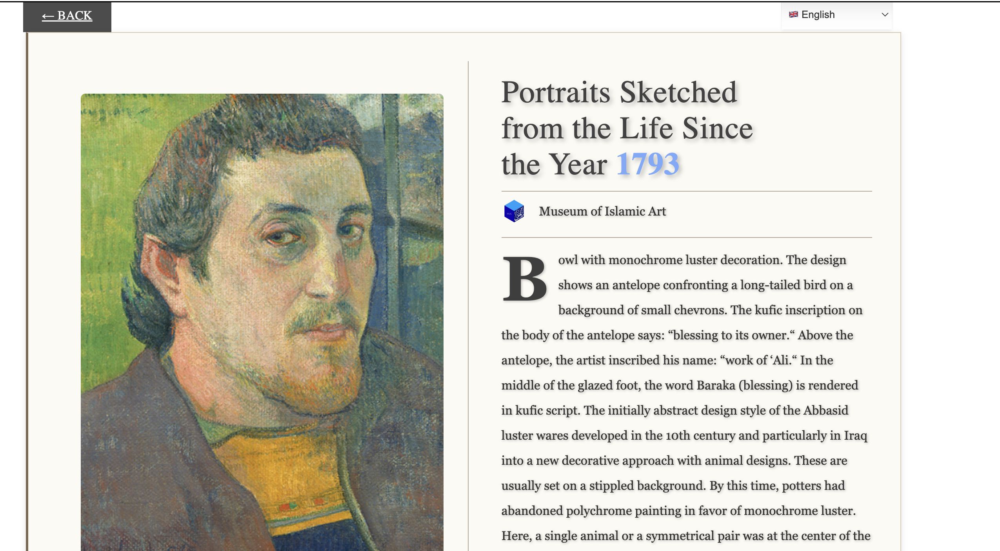
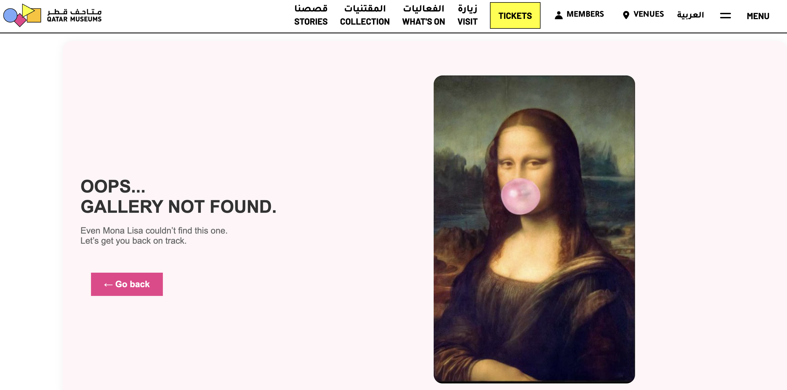

# Interactive Functionality

Ontwerp en maak voor een opdrachtgever een interactieve toepassing die voor iedereen toegankelijk is

De instructie vind je in: [INSTRUCTIONS.md](https://github.com/fdnd-task/the-web-is-for-everyone-interactive-functionality/blob/main/docs/INSTRUCTIONS.md)

## Inhoudsopgave
  * [Beschrijving](#beschrijving)
  * [Gebruik](#gebruik)
  * [Kenmerken](#kenmerken)
  * [Installatie](#installatie)
  * [Bronnen](#bronnen)
  * [Licentie](#licentie)

## Beschrijving

Voor het Qatar Museum heb ik een homepagina ontworpen waarop verschillende galerijen worden weergegeven. Bij het klikken op een galerij kom je op een detailpagina met meer informatie.
De informatie is beschikbaar in zowel het Engels als Arabisch. Voor sommige galerijen wordt de informatie direct uit de backend geladen.
Gebruikers kunnen een galerij liken door met de muis over de afbeelding te gaan en op het duimpje te klikken — deze wordt dan opgeslagen op hun profielpagina.

## Live website 

[](https://the-web-is-for-everyone-interactive-pmjw.onrender.com/)

## Screenshots van de website

  
  
  


## Gebruik
De website bestaat uit meerdere pagina’s die met elkaar verbonden zijn. Op de **homepagina** worden verschillende galerijen weergegeven.

Wanneer een gebruiker op een galerij klikt, wordt hij of zij doorgestuurd naar een **detailpagina** met extra informatie over die galerij. Deze informatie is beschikbaar in zowel **Engels als Arabisch**. Via een dropdown-menu kan de gebruiker wisselen tussen beide talen. De meeste tekst wordt opgehaald vanuit de backend.
Gebruikers kunnen een **galerij liken** door met de muis over de afbeelding te hoveren en op het duimpje te klikken. Deze like wordt opgeslagen in de database via een POST-request naar Directus. Na het liken wordt de gebruiker automatisch doorgestuurd naar de **profielpagina**, waar alle gelikete galerijen worden weergegeven. 

### Navigatie & gebruikersflow

De volledige gebruikersflow van de website — van homepage tot profielpagina — wordt stap voor stap uitgelegd in mijn [Designproces-issue (#4)](https://github.com/fatimahilali/the-web-is-for-everyone-interactive-functionality/issues/4).  
Hierin laat ik met schetsen en visuals zien hoe de gebruiker navigeert, wat er gebeurt bij een like, en hoe de content wordt opgehaald en getoond.

---

## Kenmerken

**Frontend:**  
Gebouwd met Liquid templates, CSS en GSAP (GreenSock) voor animaties.
Het project volgt het principe van Progressive Enhancement: GSAP zorgt alleen voor animaties. De site werkt ook zonder JavaScript

**Backend:**  
Opgezet met **Node.js**, **Express**, **Directus** en **Liquid**.  
De dataflow werkt als volgt:

- Data wordt opgehaald uit Directus en doorgestuurd naar Liquid views via `res.render()`
- Bij het liken van een afbeelding wordt een **POST-request** verstuurd naar de backend
- De backend verwerkt de like en slaat deze op in Directus
- De profielpagina haalt gelikete afbeeldingen op via een **GET-request**


---


##  UI States

Om de gebruikerservaring te verbeteren, heb ik meerdere UI-states geïmplementeerd:

---

###  Ideal State  
Data (titel, afbeelding, beschrijving) is beschikbaar en wordt correct getoond.  

### Screenshot


```liquid

<h1>{{ artwork.title }}</h1>
<p>{{ artwork.summary }}</p>
```

### Empty State 
Als er geen beschrijving aanwezig is, wordt een fallbacktekst weergegeven.

### Screenshot



```liquid
<p>{{ artwork.summary | default: "Fallback tekst..." }}</p>
```

### Error State
Bijvoorbeeld: als de galerij niet bestaat, krijg je een foutmelding te zien

### Screenshot



```liquid
<h1>OOPS...<br>GALLERY NOT FOUND.</h1>
<p>Even Mona Lisa couldn’t find this one.<br>Let’s get you back on track.</p>
<a href="/" class="back-button">← Go back</a>
```

## Installatie
Volg deze stappen om het project lokaal te draaien:

### 1️⃣ Clone de repository

Open je terminal en voer het volgende commando uit:

```bash
git clone https://github.com/fatimahilali/the-web-is-for-everyone-interactive-functionality.git
cd the-web-is-for-everyone-interactive-functionality

```

2️⃣ Installeer de afhankelijkheden

Installeer alle benodigde packages met:
```bash
npm install
```


3️⃣ Start de applicatie

```bash
npm start
```


4️⃣ Open in je browser

Ga in je browser naar:

```bash
http://localhost:8000
```
Nu draait je project lokaal!

## Bronnen
https://stackoverflow.com/questions/59196117/toggle-language-between-divs

https://shopify.github.io/liquid/filters/escahttps://shopify.github.io/liquid/filters/default/?utm_source=chatgpt.com

https://stackoverflow.com/questions/41746962/change-language-url-with-select-option
https://liquidjs.com/filters/newline_to_br.html

https://stackoverflow.com/questions/24875414/addeventlistener-change-and-option-selection


## Licentie

This project is licensed under the terms of the [MIT license](./LICENSE).
